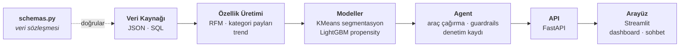

# Harcama Analizi ve Kampanya Öneri Agent Sistemi

Müşterilerin harcama verilerini özetleyerek finansal içgörüler sunan ve arka plandaki makine öğrenmesi modeliyle **hangi kampanyanın kime uygun olduğunu** belirleyip en doğru teklifleri getiren akıllı bir **LLM agent** sistemi.

Sistem kullanıcılara **iki farklı etkileşim yöntemi** sunar:
1. **Görsel Dashboard:** Kullanıcılar harcama değişimlerini, kategori dağılımlarını ve finansal trendleri tek bir ekranda grafiklerle inceleyebilir.
2. **Sohbet Agent'ı:** İlgili detayları grafikler arasında aramak istemeyen kullanıcılar, agent ile sohbet ederek durumu kısaca özetlemesini isteyebilir ve kampanya önerilerini doğrudan diyalog üzerinden alabilir.

# Problem

Günümüz finansal ekosisteminde hem müşteriler hem de bankalar açısından iki temel sorun bulunmaktadır:

1. **Müşteri Açısından (Finansal Görünürlük Eksikliği):** Kullanıcılar genellikle düzenli harcama takibi yapamaz, hangi kategoriye ne kadar harcadıklarını net bir şekilde göremez ve bu nedenle sağlıklı bir finansal harcama planlaması oluşturamazlar.
2. **Banka Açısından (Verimsiz Kampanyalar):** Bankalar kampanyaları çoğunlukla kaba segment kurallarıyla (örn. *"tüm kredi kartı müşterilerine market kampanyası"*) dağıtır. Bunun sonucu; boşa harcanan kampanya bütçeleri ve ilgisiz bildirimlerle yorulan müşterilerdir.

# Çözüm

Bu proje, her iki sorunu tek bir noktadan çözer:
- Kullanıcıya harcama alışkanlıklarını görsel dashboard ve diyalog (agent) aracılığıyla sunarak **finansal farkındalık ve kontrol** kazandırır.
- Arka planda ise; müşterinin son 30/90 günlük harcama deseni, kategori dağılımı ve trendi üzerinden her kampanya için bir **kabul olasılığı** hesaplayarak iş kurallarını uygular ve müşteriye sadece **en uygun teklifi gerekçesiyle birlikte** sunar.

# Mimari



Zincirin tek yönlü olması tesadüf değil: her katman yalnız bir alttakinin
**sözleşmesine** bağlıdır, uygulamasına değil. Arayüz modele, model veri kaynağının
JSON mu SQL mi olduğuna bakmaz.

Projenin ayrıntılı mimarisi, ajan döngüsü ve sıra diyagramları için **[docs/mimari.md](docs/mimari.md)** dosyasına göz atabilirsiniz.

Sistemin temel tasarım felsefesi **veri kaynağından bağımsız** çalışmasıdır. Üst katmanların (Model, Agent, UI) hiçbiri verinin arka planda nereden geldiğini bilmez; tüm iletişim `src/data/schemas.py` içerisindeki veri sözleşmelerine bağlıdır. Bu sayede, simüle edilmiş test verisinden gerçek banka veritabanlarına geçiş işlemi sadece veri çeken tek bir sınıfın (adapter) yazılmasına indirgenmiştir (bkz. [Gerçek veriye geçiş](#gerçek-veriye-geçiş)).

# Agent neden sadece bir model değil?

Agent, LLM'in araçları **çok adımlı** kullanmasıdır. Araç katmanı saf Python'dur
ve LLM olmadan da tek başına test edilir:

| Araç | Görev |
|---|---|
| `get_customer_profile` | Segment, kıdem, ürün sahipliği (PII içermez) |
| `analyze_spending` | Kategori dağılımı, aylık seri, trend, düzenli giderler, olağandışı artışlar |
| `score_campaigns` | Yalnızca **uygun** kampanyaları eğilim modeliyle skorlar, sıralar |
| `check_eligibility` | İş kuralları: KVKK izni, bütçe, tarih, yaş, ürün |
| `get_campaign_details` | Katalog bilgisi |

`analyze_spending` kampanya kataloğunu **okumaz**: harcama analizi tek başına anlamlı
bir çıktıdır, öneri onun üstüne oturur. Hiçbir kampanya uygun olmadığında bile ajan
müşteriye harcamasını anlatabilir.

LLM'in işi bu araçları doğru sırayla çağırmak, sonucu Türkçe gerekçelendirmek ve
müşteriye gidecek metni üretmektir. **Uygunluk kararını LLM veremez** —
`check_eligibility` çıktısı nihai cevaba karşı doğrulanır.

# Kurulum

```bash
conda create -n kampanya python=3.11 -y
conda activate kampanya
pip install -r requirements.txt

cp .env.example .env       # GROQ_API_KEY'i doldur (opsiyonel, aşağıya bak)
```

`GROQ_API_KEY` boş bırakılabilir: sistem otomatik olarak deterministik yedek moda
düşer ve demo yine baştan sona çalışır. Bu, ağ erişiminin kapalı olduğu ortamlar
ve API limiti dolduğunda demonun ayakta kalması için bilinçli bir tasarım kararıdır.

## Çalıştırma

```bash
./scripts/setup.sh          # veri -> doğrulama -> özellikler -> segmentasyon -> model
./scripts/demo.sh           # servisi açar, uçları sırayla çağırır, kapatır
./scripts/demo_ui.sh        # API + Streamlit arayüzünü birlikte başlatır
```

`setup.sh --fast` 200 müşterilik hızlı bir duman testi üretir; `--force` mevcut veriyi
yeniden üretir. Adımları tek tek çalıştırmak da mümkün:

```bash
python -m src.data.generator                # sentetik veri            (~12 sn, 362k satır)
python -m src.data.validate                 # kaynağı şemaya karşı doğrula
python -m src.features.build                # özellik tablosu          -> customer_features.parquet
python -m src.models.segmentation           # KMeans                   -> customer_segments.parquet
python -m src.models.propensity             # kabul eğilimi modeli     -> propensity.joblib

python -m src.eval.model_report             # model raporu            -> reports/model_report.md
python -m src.eval.agent_eval --n 10        # agent değerlendirmesi     -> reports/agent_eval.md

uvicorn src.api.main:app --reload           # REST servisi             -> /docs
streamlit run ui/streamlit_app.py           # arayüz (API açık olmalı)
pytest -q                                   # 312 test
```

`config.yaml` yerine başka bir konfigürasyon kullanmak için: `KAMPANYA_CONFIG=/yol/config.yaml`.
Zincirin tamamı bu değişkene uyar; uçtan uca test de yalıtımı bununla sağlar.

# API

| Uç | İş |
|---|---|
| `GET /health` | Servis ve bağımlılıklarının durumu |
| `GET /customers` | Seçim listesi için kimlikler (beyaz listeli kolonlar) |
| `GET /campaigns` | Kampanya kataloğu (arayüz öneri kartlarını bununla zenginleştirir) |
| `GET /customers/{id}/profile` | Müşteri künyesi + davranışsal segment |
| `GET /customers/{id}/spending` | Harcama analizi — kampanyadan bağımsız |
| `POST /recommend` | Harcama analizi + gerekçeli kampanya önerisi |
| `POST /chat` | Müşterinin kendi verisi hakkında serbest soru |
| `GET /docs` | Otomatik arayüz (demo buradan da yapılabilir) |

```bash
curl -X POST http://127.0.0.1:8000/recommend \
  -H 'Content-Type: application/json' -d '{"customer_id":"C000007"}'
```

Cevap gövdesi ajanın çıktısının aynısıdır: `answer` (müşteriye gidecek metin),
`tool_calls` (cevabın gerekçesi — hangi araç hangi argümanla çağrıldı), `provider`,
`fallback` ve `uyarilar` (denetim bulguları; boş liste "metindeki her sayı bir araç
çıktısına dayanıyor" demektir).

Bağımlılıklar eksikse servis yine ayağa kalkar: `/health` nedeni söyler, diğer uçlar
çalıştırılacak komutla birlikte **503** döner.

# Arayüz

`ui/streamlit_app.py` servisin bir **istemcisidir**: iş kuralı içermez, modele ve
ajana doğrudan erişmez, her şeyi HTTP üzerinden ister. Doğrudan `Agent` çağıran bir
arayüz demoyu kolaylaştırırdı ama "API katmanı gerçekten kullanılıyor mu" sorusunu
cevapsız bırakırdı.

İki sekme var. **Harcamalarım**: dönem harcaması tek büyük rakam olarak, yanında
trend rozeti; altında ikonlu kategori satırları ve pay çubukları, aylık seri, ve
analizin cümleye dönüşmüş hâli ("6 aydır aynı üye işyerine ayda ortalama 214 TL
ödüyorsunuz"). **Ajana sor**: verinin kendisinden türetilen hazır sorular, kampanya
önerisi butonu ve geçmişi olan sohbet — öneri de bir sorudur, ayrı bir ekran değil.

Sıralama tesadüf değil, ürünün iddiası bu: **önce analiz, sonra teklif**. Her cevabın
altında hangi araçların çağrıldığı ve denetim sonucu görünür.

Kategori dağılımı bar grafiği yerine **satır listesi**: "neye ne kadar" insanın
listeden okuduğu bir bilgidir, bar grafiği aynı şeyi daha fazla mürekkeple verir.
Çubuk genişliği toplam paya değil en büyük kategoriye göre ölçeklenir — payların
hepsi %10 civarındaysa aksi hâlde bütün çubuklar ezik görünür.

Denetim rozeti üç durumu ayırır: cevap denetimden geçti · denetim ilk taslakta bir
sorun yakaladı ve **metin düzelttirildi** · şablon metne düşüldü. Ortadaki durumu
hata gibi göstermek çalışan guardrail'i arıza gibi sunardı.

Etkileşim: sekmeler, kategori filtresi (seçim listeyi ve üye işyerlerini daraltır),
kategori bazlı **dönem karşılaştırma** rozetleri (önceki eşit döneme göre ▲▼, yeni
kategoriler "yeni"), kullanıcının kendi koyduğu **bütçe limiti** ve doluluk çubuğu,
üye işyeri kırılımı, geçmişi müşteri bazında tutulan sohbet, rastgele müşteri.

Bütçe limitini sistem **önermez, sorar** — limit önermek finansal tavsiye olurdu.

Görsel bileşenler: dönem toplamını ortasında taşıyan **halka grafik** (en büyük 5
kategori + "Diğer"; renkler kimlik değil büyüklük kodladığı için altın→grafit tek yönlü
ton dizisi), künyede **davranışsal segment rozeti** (KMeans çıktısı — bankanın ticari
segmentinden farkı burada görünür) ve öneri cevabının altında **kampanya kartları**
(skor `score_campaigns`'ten, ödül/asgari harcama/tarih `GET /campaigns`'ten).

Segment bilerek araç sözleşmesine (`PROFILE_FIELDS`) eklenmedi: LLM'in eline geçen her
alan cevap metnine sızabilir ve "sizi şu segmente koyduk" müşteriye söylenecek bir
cümle değil.

### Renk

Kurumsal sarı–siyah–beyaz. Sarının tuzağı ölçüldü: `#FFD100` beyaz zeminde **1,46:1**
kontrast verir, yani bar ya da çizgi olarak okunmaz; siyah zeminde **12,84:1**'dir.
Bu yüzden sarı dolgu ve vurgu rengidir (üstüne siyah yazı gelir), açık temada veri
işaretleri koyu altındır (`#A67C00`, 3,82:1), koyu temada marka sarısının kendisidir.
Palet `ui/streamlit_app.py → PALET` içinde tek yerde durur ve `tests/test_ui.py`
her rengi eşiklere karşı **ölçerek** sınar — marka hex'i değişirse testler yeni
değeri de ölçer.

## Sonuçlar

| Metrik | Değer |
|---|---|
| Kabul eğilimi modeli (LightGBM) | AUC **0.778**, PR-AUC 0.553, precision@1 0.502 |
| Rastgeleye karşı kazanç | **1.85×** |
| Gözlemlenebilir sinyal tavanı | 0.784 |
| Tek satırlık kategori kuralı (baseline) | AUC 0.769, PR-AUC 0.567 |
| Davranışsal segment sayısı | 3 (en küçüğü nüfusun %19'u) |

Model gözlemlenebilir tavanın üstünde bir şey iddia etmiyor; kural tabanlı baseline
PR-AUC'de hâlâ modeli yeniyor ve tablodan çıkarılmadı. Sızıntı kontrolü her eğitimde
yeniden ölçülür: müşteri-gruplu bölme ile satır bazlı bölme arasındaki fark **+0.003**.

## Değerlendirme

`python -m src.eval.model_report` kaydedilmiş `.joblib` paketlerinden model karnesini
üretir — yeniden eğitmez, çünkü rapor **serviste çalışan** modelin karnesi olmalı.
Baseline tablosu eksiksiz tutulur (tek satırlık kategori kuralı PR-AUC'de modeli
yeniyor) ve elenen k değerleri gerekçesiyle raporlanır ("en yüksek silhouette k=5'te
ama en küçük kümesi nüfusun %1,1'i").

`python -m src.eval.agent_eval` sabit bir müşteri örneği × sabit soru seti çalıştırır
ve her cevabı üç kovadan birine koyar: **temiz** (denetimden ilk seferde geçti),
**düzeltildi** (ihlal yakalandı, metin düzelttirildi, geçti), **yedek** (şablon metne
düşüldü). Ölçtüğü şey "cevap güzel mi" değil — sistemin kendi güvencelerini tutup
tutmadığı.

İki tuzağa karşı korumalı: sağlayıcı yanıt vermediyse (kota/limit) rapor en başta
**"bu koşu geçerli bir model ölçümü değildir"** der; örnekte izin vermeyen müşteri
yoksa "kampanya sızmadı" cümlesini kurmaz, "ölçülmedi" der.

## Denetim ve guardrails

LLM'in ürettiği metin müşteriye doğrudan gitmez; önce dört denetimden geçer:

- **izlenebilirlik** — metindeki her sayı bir araç çıktısına dayanmalı,
- **ödül** — belirtilen ödül oranı önerilen kampanyanınkiyle eşleşmeli,
- **tavsiye** — yatırım/tasarruf tavsiyesi yok (düzenlemeye tabi faaliyet),
- **kampanya** — katalogda olmayan kampanya kodu geçemez.

Denetimden geçemeyen cevap için bir düzeltme denenir, o da olmazsa deterministik
şablon metne düşülür. Her cevap `logs/audit.jsonl` dosyasına iz bırakır.

## Veri

Şu an **sentetik** veri kullanılıyor. Kampanya kataloğu (`data/raw/campaigns.json`)
elle tasarlanmıştır ve versiyonlanır; müşteri/işlem/etkileşim verisi
`src/data/generator.py` ile üretilir ve repoya girmez.

### Sentetik veride kaçınılan tuzak

Kabul etiketi (`Interaction.accepted`) basit bir kuralla üretilseydi, model o
kuralı ezberler ve AUC ~0.99 çıkardı — bu, gerçek bir başarı değil ölçüm hatasıdır.
Bunun yerine etiket, **gizli bir müşteri eğilimi** + kategori uyumu + kampanya
cazibesi + gürültü ile üretilir. Gizli eğilim özellik tablosuna doğrudan girmez,
model onu ancak dolaylı olarak tahmin edebilir.

Beklenen metrik bandı: **AUC 0.72–0.82**. Bu bant gerçekçidir ve savunulabilir.

### Gerçek veriye geçiş

1. `src/data/source.py` içindeki `SqlDataSource` sınıfını doldur (dört sorgu).
2. `config.yaml` → `data.sql.column_map` ile banka kolon adlarını şema alanlarına eşle.
3. `config.yaml` → `data.source: sql` yap.
4. `python -m src.data.validate` çalıştır.

Özellik üretimi, model, agent ve API katmanlarına **dokunulmaz**.

## Kişisel veri (KVKK) yaklaşımı

- `schemas.Customer` içinde ad, TCKN, telefon, e-posta, IBAN, kart numarası
  **alanı yoktur** — sentetik veride de üretilmez. PII sızıntısı şema seviyesinde
  imkânsızdır.
- `src/data/validate.py`, herhangi bir veri kaynağında PII kolonu görürse
  doğrulamayı hatayla sonlandırır (gerçek tabloya `SELECT *` yazılmasına karşı ağ).
- LLM'e giden her yük `guardrails.mask_payload()` üzerinden geçer.
- `opt_in_marketing` alanı ticari elektronik ileti iznidir; `check_eligibility`
  içinde **ilk** kontrol edilen kuraldır ve bir model kararı değil hukuki
  zorunluluktur.
- `gender` alanı veri bütünlüğü için tutulur ama **hedefleme özelliği olarak
  kullanılmaz**.
- Her öneri `logs/audit.jsonl` dosyasına iz bırakır: zaman, müşteri, model
  versiyonu, kullanılan özellikler, seçilen kampanya.

## Dizin yapısı

```
src/
  config.py           merkezi konfigürasyon yükleyici
  data/               şema (sözleşme), veri kaynakları, üreteç, doğrulayıcı
  features/           RFM, kategori payları, trend
  models/             segmentasyon (KMeans) + propensity (LightGBM)
  agent/              araçlar, LLM sağlayıcı, orkestrasyon, guardrails
  api/                FastAPI servisi
  audit/              denetim kaydı
ui/                   Streamlit demo arayüzü (servisin istemcisi)
scripts/              setup.sh (zincir), demo.sh (curl senaryosu), demo_ui.sh (API+UI)
reports/              model ve ajan değerlendirme raporları
tests/                312 test — uçtan uca zincir dahil (test_e2e.py)
notebooks/            EDA ve model denemeleri
```

## Durum

15 iş günlük planın tamamı bitti; **312 test** geçiyor. Plan sonrası arayüz
iki kez elden geçirildi (fintech yerleşimi, kurumsal renkler, harcama analizi
derinleştirme).

| Gün | İş | Durum |
|---|---|---|
| 1 | İskelet, veri şeması (sözleşme), kampanya kataloğu | Tamam |
| 2 | Sentetik veri üreteci | Tamam |
| 3 | EDA + özellik üretimi | Tamam |
| 4 | Davranışsal segmentasyon | Tamam |
| 5 | Kabul eğilimi modeli | Tamam |
| 6 | Araç katmanı + harcama analizi | Tamam |
| 7 | Agent orkestrasyonu (tool calling) | Tamam |
| 8 | Guardrails + denetim kaydı | Tamam |
| 9 | FastAPI servisi | Tamam |
| 10 | Uçtan uca MVP | Tamam |
| 11 | Streamlit demo arayüzü | Tamam |
| 12 | Değerlendirme koşumu ve raporlar | Tamam |
| 13 | Dokümantasyon ve mimari diyagram | Tamam |
| 14 | Sunum ve demo senaryosu | Tamam |
| 15 | Prova ve teslim | Tamam |
| — | Arayüz derinleştirme (plan dışı) | Tamam |
