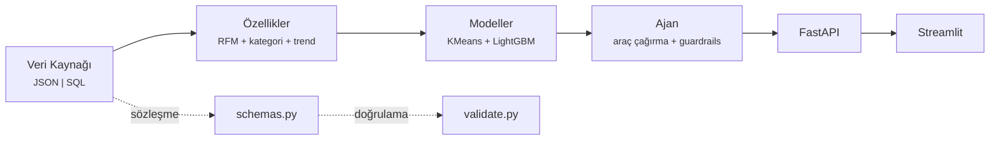
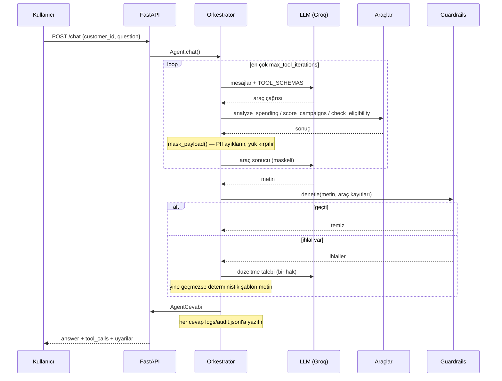
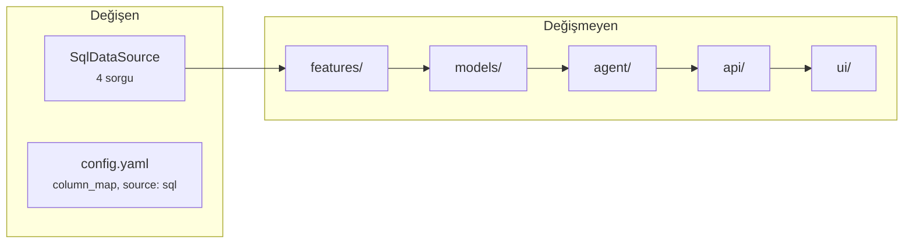

# Mimari

Sistem beş katmandan oluşur. Her katman yalnız bir alttakinin **sözleşmesine**
bağlıdır, uygulamasına değil: veri kaynağı JSON'dan SQL'e geçtiğinde özellik,
model, ajan ve API kodu değişmez.

`src/data/schemas.py` sözleşmedir. `TABLE_SCHEMAS` ve `required_columns()`,
`source.py` ve `validate.py` tarafından zorlanır; alan eklemek Pydantic modelini
değiştirmek demektir, yalnız üreteci değil.

## Ajanın bir soruyu cevaplaması

Üç şey bu diyagramda görünmeli:

- **Uygunluk kararını LLM vermez.** `check_eligibility` bir araçtır; çıktısı
  bağlayıcıdır ve `score_campaigns` skorlamadan önce kendisi eler. "LLM kontrolü
  atladı" ulaşılabilir bir durum değildir.
- **Maskeleme LLM'e gitmeden önce olur** ve kayda maskeli hâli girer. Denetçi ve
  audit log, modelin gerçekten gördüğü veriyi görür.
- **LLM olmadan da çalışır.** `GROQ_API_KEY` yoksa `MockProvider` devreye girer;
  bu bir test taklidi değil, üretim yedeğidir.

## Guardrails

Metin müşteriye gitmeden dört denetimden geçer:

| Denetim | Yakaladığı | Neden ayrı |
|---|---|---|
| `izlenebilirlik` | metindeki her sayı bir araç çıktısına dayanmalı | uydurma rakam |
| `odul` | ödül oranı önerilen kampanyanınkiyle eşleşmeli | "%25 nakit iade" izlenebilirlikten kaçar: 25 veride var ama başka bir şeyin payı |
| `tavsiye` | yatırım/tasarruf tavsiyesi | düzenlemeye tabi faaliyet |
| `kampanya` | katalog dışı kampanya kodu | uydurma teklif |

Denetimden geçemeyen metin için bir düzeltme denenir; o da tutmazsa deterministik
şablon metne düşülür. **`uyarilar` dolu olması cevabın güvensiz olduğu anlamına
gelmez** — ayrımı `fallback` verir.

## Katmanların kuralları

| Katman | Kural |
|---|---|
| `data/` | PII alanı şemada yok; sızıntı önlenmiş değil, **imkânsız** |
| `features/` | `gender`, `city` tabloya hiç girmez; `opt_in_marketing` tabloda durur ama model girdisi değildir |
| `models/` | tek propensity modeli tüm kampanyalar için; `campaign_id` özellik olamaz |
| `agent/` | analiz kampanya kataloğunu okumaz; öneri analizin üstüne oturur |
| `api/` | ince katman; cevap gövdesi `AgentCevabi.to_dict()`'in aynısı |
| `ui/` | servisin HTTP istemcisi; `src` içinden hiçbir şey import etmez |

## Gerçek veriye geçiş

1. `src/data/source.py` içindeki `SqlDataSource`'u doldur (dört sorgu).
2. `config.yaml → data.sql.column_map` ile banka kolonlarını şema alanlarına eşle.
3. `config.yaml → data.source: sql`.
4. `python -m src.data.validate` — PII kolonu görürse doğrulama hatayla durur.

Göç yüzeyi bu kadardır. Özellik üretimi, modeller, ajan ve API'ye dokunulmaz.
