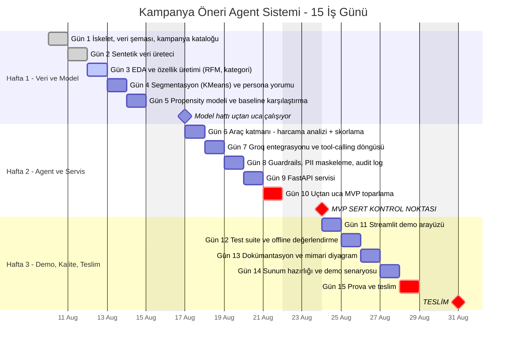

# 15 İş Günlük Proje Planı

Başlangıç: 10 Ağustos 2026 (Pazartesi) · Bitiş: 28 Ağustos 2026 (Cuma)

## Kritik yol

Kırmızı işaretli kalemler kaydırılamaz. **Gün 10** projenin tek sert kontrol
noktasıdır: o gün uçtan uca `curl` ile çalışan bir MVP yoksa kapsam daraltılır.

Feda sırası (gerekirse, bu sırayla):

1. Streamlit arayüzü — demo `/docs` üzerinden yapılır
2. Offline değerlendirme raporu
3. Segmentasyon görselleri

**Model ve agent feda edilmez** — projenin anlatısı bu ikisidir.
